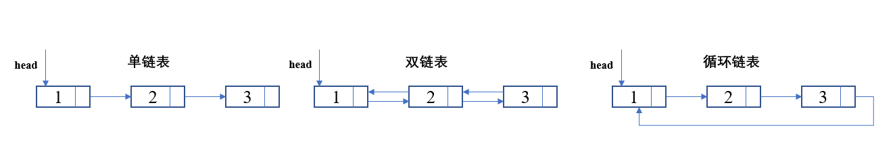
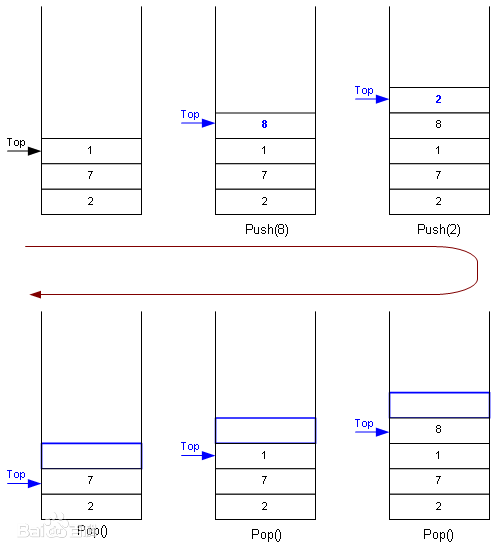
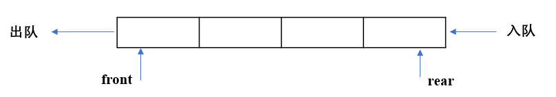

# 第一周学习总结

本周主要学习了数组、链表、跳表，栈和队列。

### 数组

在python一般采用列表来表示数组。

```python
#可以定义一个空数组
array = []
#也可以定义一个有初始值的数组
array = [1,2,3,4]
```

定义数组的过程中计算机会为数组开辟一段连续的使用空间，数组的常用操作如下：

- 查询：通过数组的索引查找相应的元素，时间复杂度为O(1)
- 末尾添加：在数组末尾添加元素，时间复杂度为O(1)
- 插入：在数组的特定位置插入一个值，对于长度为n的数组，在第i个位置上插入一个值会导致n-i+1的值向后移动，故时间复杂度为O(n)
- 删除：在数组中删除一个值，对于长度为n的数组，在第i个位置上删除一个值会导致n-i的值向前移动，故时间复杂度为O(n)
- 修改：修改对应索引下元素的值，时间复杂度为O(1)
- 遍历：顺序或倒序访问数组中每一个元素，时间复杂度为O(n)

### 链表

链表的主要类型如下：



在python中链表的节点实现方式如下：

```python
#单链表节点
class Node():
    def __init__(self,value):
        self.val = value
        self.next = None
#双链表节点
class Node():
    def __init__(self,value):
        self.val = value
        self.prev = None
        self.next = None
```

链表的节点通过next指针进行连接，因此和数组不同，链表在计算机中分配的内存空间可以不连续。

链表的常用操作如下：

- 查询：由于链表并不像数组中每个元素都存在索引，所以链表的查询只能通过循环遍历从head位置移动到需要访问的节点，故时间复杂度为O(n)
- 插入：在链表中插入一个节点，除去查询插入位置的操作外，就插入这个动作本身，只需修改当前位置后一个指针和插入节点后一个指针的指向即可，不会引起链表节点的群移，故时间复杂度为O(1)
- 删除：在链表中删除一个节点，除去查询删除节点位置的操作外，就删除节点操作本身，只需修改前一个节点的next指针以级删除节点的next指针将这个节点移出链表即可，不会引起链表节点的群移，故时间复杂度为O(1)
- 从前添加：在链表的头部添加一个节点，只需将添加节点的next指向链表的第一个节点，在将head指向新加的节点即可，不会引起链表节点的群移，故时间复杂度为O(1)
- 从后添加：在链表的尾部添加一个元素，在事先记录下当前尾部的情况下，只需将尾部节点的next指向新加的节点，将尾指针指向新增节点即可，不会引起链表节点的群移，故时间复杂度为O(1)

### 跳表

跳表的示意图如下：


由于在查询链表时需要从头进行遍历，对于一个比较长的有序链表，O(N)时间复杂度的查询就显得比较慢。为了提升有序链表的查询，采取升维的方式，上一个维度的移动步长是下一个维度的两倍，故而产生了跳表这个数据结构。

跳表的优势在于原理简单、容易实现、方便扩展、效率更高，但是前提是每个元素必须排列有序。

跳表的常用操作如下：

- 查询：在跳表中查询一个节点的值，先在高维度的位置快速移动到该节点附近的位置，之后再下维度寻找，直到最终找到为止。由于上一个维度的移动步长是下一个维度的两倍，所以时间复杂度为O(log(n))
- 添加：在跳表中新增一个节点，新增一个节点后，为了保持跳表的查询效率，需要在插入数据的时候，索引节点也需要相应的增加、或者重建索引，来避免查找效率的退化。由于上一个维度的移动步长是下一个维度的两倍，故整个添加过程的时间复杂度为O(log(n))
- 删除：跳表删除数据时，要把索引中对应节点也要删掉，由于上一个维度的移动步长是下一个维度的两倍，故整个删除过程的时间复杂度为O(log(n))

### 栈

栈的示意图如下：



栈的常用操作如下：

- 判断栈是否为空：时间复杂度为O(1)
- 入栈：将元素从栈顶放入，时间复杂度为O(1)
- 出栈：若栈不为空，将栈顶元素出栈，时间复杂度为O(1)
- 查询栈顶元素：若栈不为空，查找当前栈顶元素的值，不改变栈内当前元素，时间复杂度为O(1)

从栈的操作可知，栈的特性为后入先出（LIFO)

### 队列

队列的示意图如下：



与栈不同，队列的特性是先入先出(FIFO)。

队列的常用操作如下：

- 判断队列是否为空：时间复杂度为O(1)
- 入队：从队列尾部将元素放入队列，时间复杂度为O(1)
- 出队：队首元素从队列的头部移出队列，时间复杂度为O(1)
- 查询队尾元素：查询当前队尾元素的值，时间复杂度为O(1)
- 查询队首元素：查询当前队首元素的值，时间复杂度为O(1)

队列主要分为顺序队列，双端队列和循环队列

### 作业部分

1. 用 add first 或 add last 这套新的 API 改写 Deque 的代码

   ```python
   #采用列表设计deque
   class deque():
       def __init__(self,N):
           self.queue = []
           self._size = 0
           #deque最大允许的长度
           self._capacity = N
   
       def addfirst(self,value):
           if self._size == self._capacity:
               self.queue.pop()
           else:
               self._size += 1
           self.queue.insert(0,value)
   
       def addlast(self,value):
           if self._size == self._capacity:
               self.queue.pop(0)
           else:
               self._size += 1
           self.queue.append(value)
   
       def deletefirst(self):
           if self.isEmpty():
               print('队列为空，无法删除')
           else:
               self.queue.pop(0)
               self._size -= 1
   
       def deletelast(self):
           if self.isEmpty():
               print('队列为空，无法删除')
           else:
               self.queue.pop()
               self._size -= 1
   
       def getfirst(self):
           if self.isEmpty():
               print('队列为空，队首没有元素')
           else:    
           	return self.queue[0]
   
       def getlast(self):
           if self.isEmpty():
               print('队列为空，队尾没有元素')
           else:     
           	return self.queue[-1]
   
       def isEmpty(self):
           return self._size == 0
   
       def size(self):
           return self._size
   
   if __name__ == '__main__':
       dq = deque(5)
       dq.addlast("a")
       dq.addfirst("b")
       dq.addlast("c")
       dq.addfirst("d")
       print(dq.queue)
       value1 = dq.getfirst()
       print(value1)
       print(dq.queue)
       value2 = dq.getlast()
       print(value2)
       print(dq.queue)
       while dq.size() > 0:
           dq.deletefirst()
           print(dq.queue)
           dq.deletelast()
           print(dq.queue)
   ```

   采用列表来设计deque的弊端就是addfirst和deletefirst操作会导致deque内元素的群体迁移，故这两个操作的时间复杂度为O(n)

2. 分析Priority Queue的源码

   python中使用Priority Queue可以调用queue模块中的PriorityQueue，具体源码如下：

   ```python
   class PriorityQueue(Queue):
       '''Variant of Queue that retrieves open entries in priority order (lowest first).
   
       Entries are typically tuples of the form:  (priority number, data).
       '''
   
       def _init(self, maxsize):
           self.queue = []
   
       def _qsize(self):
           return len(self.queue)
   
       def _put(self, item):
           heappush(self.queue, item)
   
       def _get(self):
           return heappop(self.queue)
   ```

   从源码中可以看出，Priority Queue的核心部分put（将元素放入Priority Queue）和get（将最小元素从Priority Queue中取出）方法调用了python中的heapq模块，也就是说python采用最小堆来设计优先队列。heapq中的heappush和heappop相关的源码如下：

   ```python
   def heappush(heap, item):
       """Push item onto heap, maintaining the heap invariant."""
       heap.append(item)
       _siftdown(heap, 0, len(heap)-1)
   
   def heappop(heap):
       """Pop the smallest item off the heap, maintaining the heap invariant."""
       lastelt = heap.pop()    # raises appropriate IndexError if heap is empty
       if heap:
           returnitem = heap[0]
           heap[0] = lastelt
           _siftup(heap, 0)
           return returnitem
       return lastelt
   
   # 'heap' is a heap at all indices >= startpos, except possibly for pos.  pos
   # is the index of a leaf with a possibly out-of-order value.  Restore the
   # heap invariant.
   def _siftdown(heap, startpos, pos):
       newitem = heap[pos]
       # Follow the path to the root, moving parents down until finding a place
       # newitem fits.
       while pos > startpos:
           parentpos = (pos - 1) >> 1
           parent = heap[parentpos]
           if newitem < parent:
               heap[pos] = parent
               pos = parentpos
               continue
           break
       heap[pos] = newitem
   
   def _siftup(heap, pos):
       endpos = len(heap)
       startpos = pos
       newitem = heap[pos]
       # Bubble up the smaller child until hitting a leaf.
       childpos = 2*pos + 1    # leftmost child position
       while childpos < endpos:
           # Set childpos to index of smaller child.
           rightpos = childpos + 1
           if rightpos < endpos and not heap[childpos] < heap[rightpos]:
               childpos = rightpos
           # Move the smaller child up.
           heap[pos] = heap[childpos]
           pos = childpos
           childpos = 2*pos + 1
       # The leaf at pos is empty now.  Put newitem there, and bubble it up
       # to its final resting place (by sifting its parents down).
       heap[pos] = newitem
       _siftdown(heap, startpos, pos)    
   ```

   堆在每次新增一个元素时都要对整个堆做siftdown操作，目的是要把堆中元素重新放到各自合适的位置，最小值放在堆的根部，整体时间复杂度为O(log(n))，在每次删除一个元素时，都要先把末尾元素先放置根部，再执行siftdown操作把该节点放置合适的位置，将最小节点一直根部，整体时间复杂度为O(log(n))